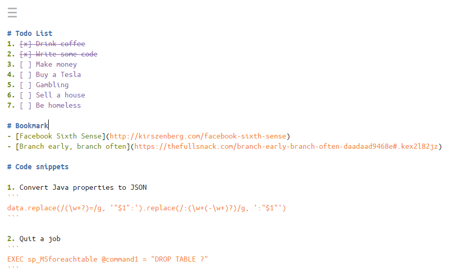

# A Markdown-based Notepad

Don't think, just use it: [https://writerm.herokuapp.com/](https://writerm.herokuapp.com/)



It's just a markdown editor, with no preview, lol.

## Want it on your own server?

Just click here:

[](https://heroku.com/deploy?template=https://github.com/huytd/notepad)

## Still not satisfied? Develop it!

Get the source code:

```
git clone https://github.com/huytd/notepad
```

Install the dependencies:

```
npm install
```

Run the dev server:

```
npm run watch
```

Then, just write some code and get back to the browser, you don't have to refresh, `webpack-dev-server` will do it for you.

When you satisfied, just commit, push and create [Pull Request](https://github.com/huytd/notepad/pulls) (if you want :P, but yes, please)